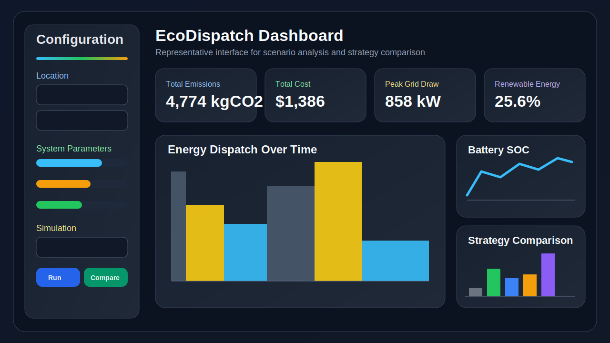
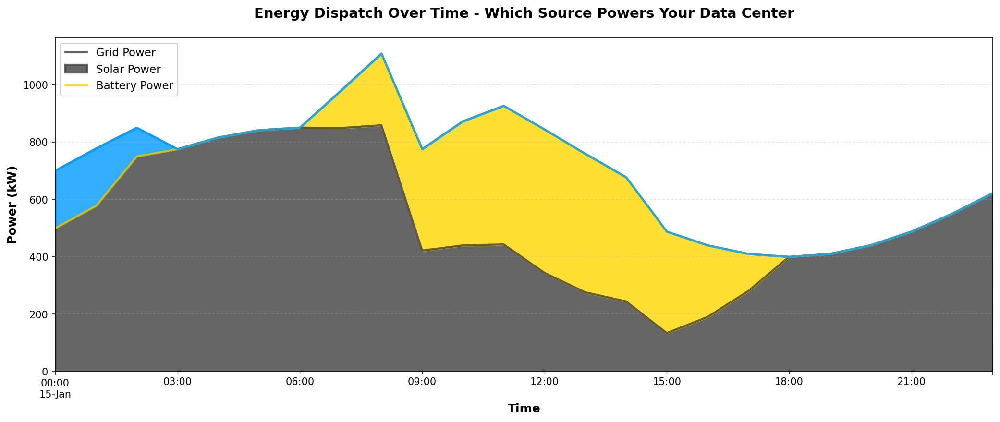
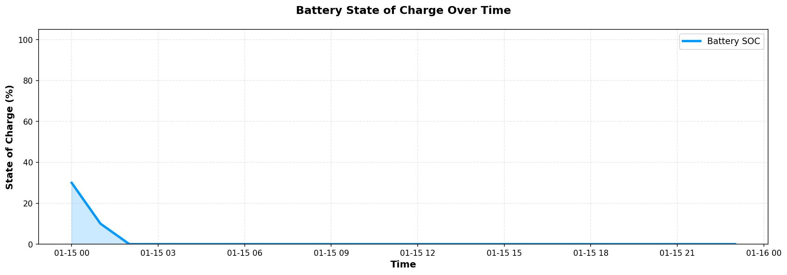
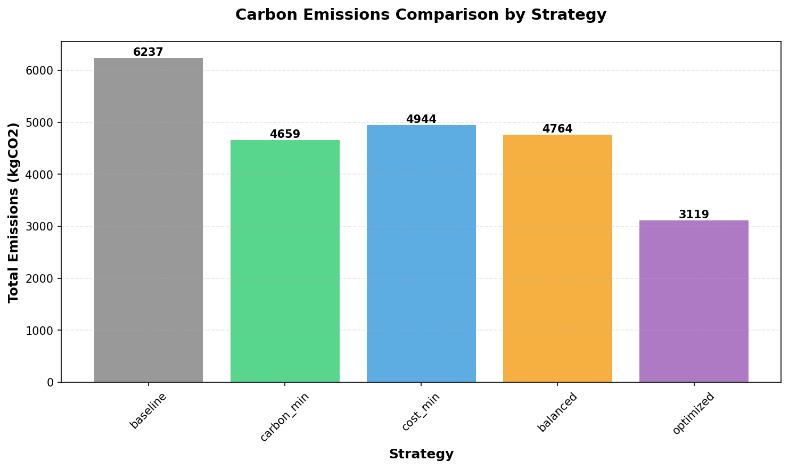

# EcoDispatch — Carbon-Aware Data Center Energy Optimization Prototype

EcoDispatch is a Python-based prototype for modeling how a data center can coordinate grid electricity, on-site solar, battery storage, and flexible workloads to reduce emissions and energy cost. It is designed as a simulation and scenario-analysis tool for engineering exploration, not as a production dispatch controller.

The project matters because data centers are large, time-varying energy consumers, and even modest improvements in when and how they draw power can materially reduce carbon impact. EcoDispatch provides a concrete way to study those tradeoffs through repeatable benchmark scenarios, strategy comparisons, and an interactive dashboard.

## Why This Project Matters

- Data center energy demand is growing alongside AI and cloud workloads.
- Grid carbon intensity changes hour by hour, so scheduling decisions can affect emissions.
- On-site solar and batteries add flexibility, but they also add operational complexity.
- Prototype tools like this help evaluate dispatch strategies before moving toward real operational systems.

## Key Features

- Time-series simulation of demand, carbon intensity, weather, electricity price, and energy dispatch.
- Multiple dispatch strategies: `baseline`, `carbon_min`, `cost_min`, `balanced`, and `optimized`.
- Battery model with state-of-charge tracking, power limits, and degradation effects.
- Solar generation model with weather-aware adjustments and configurable capacity.
- Flexible workload shifting for carbon-aware scheduling experiments.
- Streamlit dashboard for scenario configuration and strategy comparison.
- Plot generation for dispatch mix and battery state-of-charge.
- Hardware demo stubs for Arduino and Raspberry Pi integration concepts.

## System Architecture

EcoDispatch is organized as a small simulation stack:

1. Data loaders generate or ingest time-series inputs for demand, price, weather, and carbon intensity.
2. Component models estimate available solar generation, battery behavior, and flexible demand.
3. Dispatch strategies decide how much energy comes from grid, solar, and battery at each timestep.
4. Metrics summarize emissions, cost, renewable utilization, and peak grid draw.
5. The dashboard and demo scripts present results through charts and comparison tables.

```text
+-------------------+      +----------------------+      +----------------------+
| Input Data        | ---> | Simulation Engine    | ---> | Results + KPIs       |
| demand            |      | dispatch strategies  |      | emissions            |
| carbon intensity  |      | battery model        |      | cost                 |
| electricity price |      | solar model          |      | renewable fraction   |
| weather           |      | workload shifting    |      | peak grid draw       |
+-------------------+      +----------------------+      +----------------------+
                                      |
                                      v
                           +------------------------+
                           | Presentation Layer     |
                           | Streamlit dashboard    |
                           | demo plots / outputs   |
                           +------------------------+
```

## Tech Stack

- Python
- Pandas
- NumPy
- SciPy
- Matplotlib
- Streamlit
- Requests

## Repository Structure

```text
EcoDispatch/
├── src/
│   └── ecodispatch/
│       ├── __init__.py
│       ├── data_integration.py
│       ├── dispatch.py
│       ├── metrics.py
│       ├── models.py
│       ├── simulation.py
│       └── visualization.py
├── data/
│   └── sample_data.csv
├── docs/
│   ├── architecture.md
│   └── screenshots/
│       └── README.md
├── hardware/
│   ├── README.md
│   ├── battery_monitor_arduino.ino
│   └── battery_monitor_rpi.py
├── outputs/
│   └── .gitkeep
├── tests/
│   └── test_models.py
├── dashboard.py
├── demo.py
├── main.py
├── requirements.txt
├── .gitignore
├── LICENSE
└── README.md
```

## Installation

```bash
git clone https://github.com/rosethperera/EcoDispatch.git
cd EcoDispatch

python -m venv .venv
.venv\Scripts\activate

pip install -r requirements.txt
```

If you are using macOS or Linux, activate the virtual environment with:

```bash
source .venv/bin/activate
```

## How To Run The Prototype

### Run the demo script

```bash
python demo.py
```

Expected behavior:

- runs all dispatch strategies
- prints a comparison table in the terminal
- writes charts to `outputs/`

### Run the Streamlit dashboard

```bash
streamlit run dashboard.py
```

The dashboard allows you to:

- adjust battery size, solar size, and flexible load fraction
- run a single dispatch strategy
- compare all strategies side by side
- inspect dispatch, emissions, battery SOC, and weather summaries

### Run the test suite

```bash
python -m unittest discover -s tests -q
```

## Example Outputs

Representative prototype outputs include:

- strategy comparison table with emissions, cost, renewable fraction, and peak grid draw
- dispatch stack chart showing grid, solar, and battery contribution over time
- battery state-of-charge chart
- dashboard comparison view across all strategies

Generated artifacts from `demo.py` are written to:

- `outputs/demo_dispatch.png`
- `outputs/demo_battery_soc.png`

## Key Results

The current implementation is best framed as a benchmark simulation platform. In prototype scenarios, the optimized strategies generally reduce emissions and grid dependence relative to the baseline strategy, while the exact improvement depends on the synthetic input profile, battery size, solar availability, and flexible load assumptions.

Examples from recent benchmark runs:

- `carbon_min` and `optimized` consistently outperform the baseline on emissions in 24-hour scenarios.
- `optimized` typically shows the highest renewable fraction in the included demo runs.
- workload shifting can reduce emissions, but the results should be treated as prototype scenario outputs rather than validated operational forecasts.

## Screenshots

Representative visuals from the prototype are included below.

### Dashboard view



### Energy dispatch chart



### Battery SOC chart



### Strategy comparison



## Folder Notes

- `src/ecodispatch/` contains the core simulation package.
- `dashboard.py` is the Streamlit entry point.
- `demo.py` is the main portfolio/demo script for quick evaluation.
- `outputs/` is reserved for generated charts and result artifacts.
- `hardware/` contains prototype hardware integration examples, not production firmware.
- `docs/` contains architecture notes and screenshot placeholders for GitHub presentation.

## Professional Summary

EcoDispatch demonstrates a practical engineering workflow around energy systems modeling: time-series simulation, dispatch strategy design, KPI analysis, visualization, and lightweight validation. It is appropriate to present as a prototype for carbon-aware data center energy optimization, a simulation platform for evaluating dispatch strategies, or a portfolio project focused on sustainability-oriented systems engineering.

## Future Improvements

- replace synthetic data generation with validated external data feeds
- add scenario configuration files for repeatable benchmark cases
- improve optimization rigor and objective weighting transparency
- expand validation coverage for energy balance, tariff logic, and battery behavior
- store dashboard exports and comparison reports automatically in `outputs/`
- add CI checks for formatting, tests, and static analysis
- include committed screenshots or a short demo GIF for stronger GitHub presentation

## Resume-Ready Summary

Suggested concise description:

`Built EcoDispatch, a Python simulation prototype for carbon-aware data center energy optimization, modeling dispatch across grid, solar, battery storage, and flexible workloads with a Streamlit dashboard for scenario analysis.`

## License

This repository is released under the MIT License. See [LICENSE](LICENSE).
